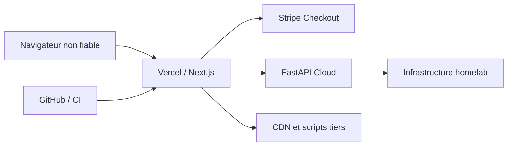

# Modèle de menaces — nabla-site-alban

**Périmètre :** runtime Next.js/App Router sur Vercel, routes API, pages EN/FR, Checkout Stripe et lecture du catalogue/snapshot homelab.  
**Méthode :** STRIDE simplifié, revue statique du code et des frontières documentées sur `master` au 10 octobre 2026. Il s'agit d'une **analyse de conception**, non d'un audit dynamique ni d'une preuve d'exploitation.

## Actifs et frontières de confiance

| Frontière | Entrées | Actifs à préserver | Principe |
| --- | --- | --- | --- |
| Navigateur → Vercel | URL, formulaire, POST API, en-têtes | Disponibilité, intégrité des réponses, origine des redirects | Toutes les entrées client sont non fiables |
| Vercel → Stripe | Identifiants et configuration serveur | Clé Stripe, prix, création de sessions | Secret exclusivement serveur ; aucun montant client autoritaire |
| Vercel → FastAPI Cloud | Catalogue, états runtime, provenance | Exactitude des statuts homelab, confidentialité des URLs privées | Une preuve absente/périmée n'est ni OK ni panne confirmée |
| Site → ressources historiques/CDN | HTML CV allowlisté, assets, scripts tiers | Intégrité DOM, CSP, vie privée | Contrôler l'allowlist et réduire les dépendances tierces |
| GitHub → Vercel | Commits, workflow, déploiements | Supply chain, secrets, intégrité du build | Publication liée à un HEAD exact et scans maintenus |

## Scénarios prioritaires

| ID | Menace STRIDE | Surface et conséquence | Contrôle observé ou à vérifier | Priorité |
| --- | --- | --- | --- | --- |
| TM-01 | Déni de service | POST `/api/create-checkout-session` répété : sessions Stripe et coûts/quota induits | Route serveur existante ; **rate limiting à implémenter**, avec observabilité 429 | P1 |
| TM-02 | Usurpation / CSRF | POST navigateur déclenché depuis un autre site | **Vérifier Origin/Fetch Metadata** sur les POST interactifs ; prévoir une politique explicite pour clients non navigateurs | P1 |
| TM-03 | Altération / redirection | Host ou Origin contrôlé par le client utilisé pour `success_url` / `cancel_url` | La route construit ces URLs depuis `DOMAIN`/`VERCEL_URL`, pas depuis Host. **Vérifier la configuration effective** ; garder un test anti-open-redirect | P1 |
| TM-04 | Divulgation | Réponses ou erreurs exposant URLs LAN, tokens, détails de providers | Limiter les données renvoyées, nettoyer les erreurs, tester les sérialisations API | P1 |
| TM-05 | Altération de preuve | Snapshot FastAPI périmé pris pour une indisponibilité fraîche ou une réussite | Maintenir provenance, fraîcheur et cause séparées ; régressions sur les états non concluants | P1 |
| TM-06 | Exécution de script | Fragments HTML historiques, CDN et scripts tiers | Loader CV allowlisté ; poursuivre CSP stricte et audit des injections sans supprimer les exceptions nécessaires | P1 |
| TM-07 | Altération supply chain | Dépendance ou artefact compromis, scan contourné | Conserver SAST, BetterLeaks, Playwright, ZAP, preuve exact-SHA ; compléter SBOM/provenance/signature | P1 |
| TM-08 | Déni de service / élévation | Endpoint API homelab utilisé comme proxy vers une destination arbitraire | L'architecture documente l'absence de route de probe URL générique ; tester cet invariant après chaque refactor | P1 |

## Critères de validation

Les contrôles existants sont des **éléments de conception** et ne valent pas vérification de déploiement. Pour clore chaque risque, rattacher au HEAD :
- un test négatif reproductible (requête refusée, absence de fuite, état non concluant inchangé) ;
- le comportement attendu en cas de service externe dégradé ou inaccessible ;
- la preuve CI/local-first et, pour les routes runtime, les gates Preview pertinentes ;
- un propriétaire de remédiation et une revue après changement de frontière.

### Mesures par risque

**TM-01 / TM-02 :** définir le budget de requêtes et la clé de limitation (IP de confiance côté edge ou identifiant de session), refuser hors quota avec `429` et `Retry-After`, considérer les proxies et éviter toute confiance dans `X-Forwarded-For` fourni directement par un client. Pour les POST navigateur, valider un `Origin` attendu et les règles `Sec-Fetch-Site` pertinentes ; un `Origin` absent demande un traitement explicite et testé. Le contrôle d'origine **ne remplace pas** la limitation ni une protection anti-abus.

**TM-03 :** ajouter des tests de configuration `DOMAIN` malformée (userinfo, protocoles inattendus, paramètres de chemin), ainsi qu'un contrôle de l'URL de retour produite. La configuration réelle de Vercel demeure à auditer.

**TM-04 / TM-05 :** assertions de non-divulgation et de provenance sur les payloads `/api/homelab-services` et `/api/homelab-health`. Distinguer absence de preuve, stale, état local, état effectif et dégradation du fournisseur.

**TM-06 / TM-07 / TM-08 :** compléter l'inventaire des ressources chargées, maintenir les scans et refuser l'introduction d'une sonde SSRF arbitraire.

## Limites et mise à jour

Cette analyse n'inclut pas de scan authentifié, de pentest, de vérification des variables Vercel ou des règles réseau effectives. Elle doit être révisée lors d'une nouvelle route API, d'une évolution des limites de confiance, de la migration catalogue v2 ou d'un changement Stripe. Les tâches ouvertes restent exclusivement dans `docs/quality-roadmap.md` et `docs/homelab-roadmap.md`.
