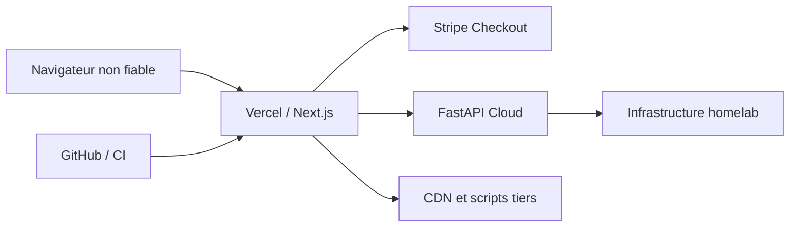

# Modèle de menaces — nabla-site-alban

**Périmètre :** runtime Next.js/App Router sur Vercel, routes API, pages EN/FR, Checkout Stripe et lecture du catalogue/snapshot homelab.  
**Méthode :** STRIDE simplifié, revue statique du code et des frontières documentées sur `master` au 10 octobre 2026. Il s'agit d'une **analyse de conception**, non d'un audit dynamique ni d'une preuve d'exploitation.

## Actifs et frontières de confiance

| Frontière | Entrées | Actifs à préserver | Principe |
| --- | --- | --- | --- |
| Navigateur → Vercel | URL, formulaire, POST API, en-têtes | Disponibilité, intégrité des réponses, origine des redirects | Toutes les entrées client sont non fiables |
| Vercel → Stripe | Identifiants et configuration serveur | Clé Stripe, prix, création de sessions | Secret exclusivement serveur ; aucun montant client autoritaire |
| Vercel → FastAPI Cloud | Catalogue, états runtime, provenance | Exactitude des statuts homelab, confidentialité des URLs privées | Une preuve absente/périmée n'est ni OK ni panne confirmée |
| Site → ressources historiques/CDN | HTML CV allowlisté, assets, scripts tiers | Intégrité DOM, CSP, vie privée | Contrôler l'allowlist et réduire les dépendances tierces |
| GitHub → Vercel | Commits, workflow, déploiements | Supply chain, secrets, intégrité du build | Publication liée à un HEAD exact et scans maintenus |

## Scénarios prioritaires

| ID | Menace STRIDE | Surface et conséquence | Contrôle observé ou à vérifier | Priorité |
| --- | --- | --- | --- | --- |
| TM-01 | Déni de service | POST `/api/create-checkout-session` répété : sessions Stripe et coûts/quota induits | Route serveur existante ; **rate limiting à implémenter**, avec observabilité 429 | P1 |
| TM-02 | Usurpation / CSRF | POST navigateur déclenché depuis un autre site | **Vérifier Origin/Fetch Metadata** sur les POST interactifs ; prévoir une politique explicite pour clients non navigateurs | P1 |
| TM-03 | Altération / redirection | Host ou Origin contrôlé par le client utilisé pour `success_url` / `cancel_url` | La route construit ces URLs depuis `DOMAIN`/`VERCEL_URL`, pas depuis Host. **Vérifier la configuration effective** ; garder un test anti-open-redirect | P1 |
| TM-04 | Divulgation | Réponses ou erreurs exposant URLs LAN, tokens, détails de providers | Limiter les données renvoyées, nettoyer les erreurs, tester les sérialisations API | P1 |
| TM-05 | Altération de preuve | Snapshot FastAPI périmé pris pour une indisponibilité fraîche ou une réussite | Maintenir provenance, fraîcheur et cause séparées ; régressions sur les états non concluants | P1 |
| TM-06 | Exécution de script | Fragments HTML historiques, CDN et scripts tiers | Loader CV allowlisté ; poursuivre CSP stricte et audit des injections sans supprimer les exceptions nécessaires | P1 |
| TM-07 | Altération supply chain | Dépendance ou artefact compromis, scan contourné | Conserver SAST, BetterLeaks, Playwright, ZAP, preuve exact-SHA ; compléter SBOM/provenance/signature | P1 |
| TM-08 | Déni de service / élévation | Endpoint API homelab utilisé comme proxy vers une destination arbitraire | L'architecture documente l'absence de route de probe URL générique ; tester cet invariant après chaque refactor | P1 |

## Critères de validation

Les contrôles existants sont des **éléments de conception** et ne valent pas vérification de déploiement. Pour clore chaque risque, rattacher au HEAD :
- un test négatif reproductible (requête refusée, absence de fuite, état non concluant inchangé) ;
- le comportement attendu en cas de service externe dégradé ou inaccessible ;
- la preuve CI/local-first et, pour les routes runtime, les gates Preview pertinentes ;
- un propriétaire de remédiation et une revue après changement de frontière.

### Mesures par risque

**TM-01 / TM-02 :** définir le budget de requêtes et la clé de limitation (IP de confiance côté edge ou identifiant de session), refuser hors quota avec `429` et `Retry-After`, considérer les proxies et éviter toute confiance dans `X-Forwarded-For` fourni directement par un client. Pour les POST navigateur, valider un `Origin` attendu et les règles `Sec-Fetch-Site` pertinentes ; un `Origin` absent demande un traitement explicite et testé. Le contrôle d'origine **ne remplace pas** la limitation ni une protection anti-abus.

**TM-03 :** ajouter des tests de configuration `DOMAIN` malformée (userinfo, protocoles inattendus, paramètres de chemin), ainsi qu'un contrôle de l'URL de retour produite. La configuration réelle de Vercel demeure à auditer.

**TM-04 / TM-05 :** assertions de non-divulgation et de provenance sur les payloads `/api/homelab-services` et `/api/homelab-health`. Distinguer absence de preuve, stale, état local, état effectif et dégradation du fournisseur.

**TM-06 / TM-07 / TM-08 :** compléter l'inventaire des ressources chargées, maintenir les scans et refuser l'introduction d'une sonde SSRF arbitraire.

## Référentiel et relation exacte avec DSOMM

**STRIDE n'est pas une exigence DSOMM ni un scanner.** Il s'agit d'une taxonomie Microsoft : **S**poofing (usurpation), **T**ampering (altération), **R**epudiation (répudiation), **I**nformation disclosure (divulgation), **D**enial of service (déni de service), **E**levation of privilege (élévation de privilèges).

Dans OWASP DSOMM, l'activité **« Conduction of simple threat modeling on technical level »**, de niveau 1, recommande explicitement des checklists simples telles que STRIDE et des menaces/mesures documentées :
- référence stable : https://dsomm.owasp.org/activity-description?uuid=47419324-e263-415b-815d-e7161b6b905e
- `activityUuid` : `47419324-e263-415b-815d-e7161b6b905e`
- modèle local du site : snapshot DSOMM **5.0.2** piné ; version publique DSOMM **5.1.0** au 10 octobre 2026. Vérifier par UUID la présence et le libellé dans chaque snapshot avant toute migration.
- preuve candidate : le présent document et les tests futurs. **Aucun claim « fully-implemented » ne doit être déduit de la simple rédaction par IA** ; revue humaine et vérification des flux/mesures requises.

Les autres activités de modélisation métier, d'abuse stories et de threat modeling avancé ont leurs propres objectifs et doivent être évaluées séparément.

## Fiches de scénarios — attaque, préconditions, preuve et contrôle

Les huit identifiants `TM-xx` représentent des **scénarios à vérifier** et non huit vulnérabilités prouvées. La classification STRIDE décrit le type d'atteinte, pas une probabilité mesurée.

### TM-01 — Saturation ou abus de Checkout (D)

- **Actif :** disponibilité de `POST /api/create-checkout-session`, quota et coûts associés à Stripe.
- **Adversaire / préconditions :** client Internet capable d'émettre de nombreuses requêtes ; intégration Stripe active.
- **Chemin :** requêtes répétées → création de sessions côté Stripe → consommation de ressources ou saturation.
- **Impact :** dégradation du parcours de paiement, coût opérationnel, bruit de diagnostic.
- **Code constaté :** la route appelle `stripe.checkout.sessions.create` après lecture du corps ; aucune limitation explicite n'est visible dans ce handler. Cela **ne prouve pas** l'absence d'une protection Vercel/WAF externe.
- **Mesures :** limitation distribuée résistante aux instances éphémères, identifiant client fiable, seuils adaptés au trafic, `429` et `Retry-After` ; métriques sans PII.
- **Validation :** tests unitaires du seuil et de l'échec du stockage partagé ; essai contrôlé sur Preview après vérification des protections edge.
- **État :** risque plausible, protection déployée non vérifiée.

### TM-02 — Requête cross-site non attendue (S / T)

- **Actif :** intégrité du déclenchement de Checkout.
- **Adversaire / préconditions :** site tiers amenant un navigateur à soumettre le formulaire ; aucune authentification préalable n'est présumée.
- **Chemin :** formulaire/POST déclenché depuis une autre origine → création d'une session sans intention de la personne qui visite.
- **Impact :** création abusive de sessions et consommation du quota ; **pas** de paiement effectué à lui seul.
- **Code constaté :** le handler ne valide pas explicitement `Origin` ni `Sec-Fetch-Site`. **CSRF au sens de détournement d'une session authentifiée n'est pas établi**, puisqu'aucune session utilisateur n'est documentée ici.
- **Mesures :** politique Origin + Fetch Metadata pour les navigateurs, compatible avec les POST HTML/JSON légitimes ; ne pas considérer ces en-têtes comme une authentification universelle.
- **Validation :** POST même origine accepté ; origine étrangère rejetée ; Origin absent et clients machine traités selon un contrat écrit.
- **État :** garde de route à évaluer et documenter.

### TM-03 — Mauvaise URL de retour (T)

- **Actif :** destination Stripe `success_url` et `cancel_url`.
- **Adversaire / préconditions :** influence sur la configuration de déploiement ou découverte d'une normalisation ambiguë de `DOMAIN`/`VERCEL_URL`.
- **Chemin :** origine de confiance mal définie → URL de retour inattendue.
- **Code constaté :** les URL proviennent de variables serveur, pas de `Host`; le parseur `originFromDomainEnv` accepte cependant des URL avec chemin, qu'il ignore pour ne garder que l'origine, alors que le texte d'erreur indique « no path ».
- **Mesures :** valider strictement `DOMAIN` comme origine pure ; encadrer le host Vercel autorisé ; conserver les tests de refus des credentials/schémas.
- **Validation :** cas chemin, query, fragment, userinfo, protocoles non HTTP, hostname trompeur.
- **État :** divergence de contrat de validation identifiée dans la lecture statique ; impact exploitable non démontré.

### TM-04 — Exposition de détails internes (I)

- **Actif :** informations d'infrastructure, accès privés et erreurs provider.
- **Adversaire / préconditions :** accès public aux réponses des API homelab.
- **Chemin :** champ interne ou erreur non nettoyée propagé dans une réponse JSON.
- **Impact :** renseignement utile à une attaque ultérieure ; risque de divulgation de token selon les champs réels.
- **Mesures :** schéma de sortie en allowlist, séparation URL publique/privée, sanitation systématique des exceptions.
- **Validation :** fixtures contenant token, IP privée ou header Authorization et assertions négatives sur la réponse publique.
- **État :** menace à tester ; aucune fuite actuelle démontrée.

### TM-05 — Présentation trompeuse d'une preuve périmée (T / R)

- **Actif :** intégrité et traçabilité de la santé présentée sur le site.
- **Adversaire / préconditions :** indisponibilité partielle, latence ou snapshot périmé du provider ; attaque intentionnelle non requise.
- **Chemin :** observation obsolète → badge « OK » ou « panne » non justifié.
- **Impact :** mauvaise décision d'exploitation ou masquage d'incident.
- **Mesures :** fraîcheur, source, horodatage, état local/effectif et incertitude conservés indépendamment.
- **Validation :** tests stale, timeout, HTTP 503 confirmé, preuve absente ; la PR #215 a déjà renforcé cette distinction.
- **État :** risque opérationnel avec mitigations déjà présentes, non qualifié comme attaque active.

### TM-06 — Script tiers ou HTML non fiable (T / I)

- **Actif :** intégrité de la page et confidentialité des données du navigateur.
- **Adversaire / préconditions :** dépendance tierce compromise ou contenu HTML qui échappe aux garde-fous du loader.
- **Chemin :** script exécuté dans l'origine du site → altération DOM / collecte indue.
- **Mesures :** CSP resserrée, contrôle des ressources tierces, loader CV à chemins explicitement autorisés et réduction des scripts legacy.
- **Validation :** audit des sources, tests de chemins CV, rapport CSP et tests navigateur.
- **État :** exposition théorique, pas de XSS prouvée.

### TM-07 — Compromission de dépendance ou de pipeline (S / T / E)

- **Actif :** code publié, secrets CI et provenance du build.
- **Adversaire / préconditions :** dépendance npm, action CI ou compte de publication compromis.
- **Chemin :** code non fiable dans build/test → artefact ou secrets altérés.
- **Mesures :** pinning, lockfile, permissions minimales, SAST, BetterLeaks, SBOM, provenance, scans Playwright/ZAP et publication liée à un commit exact.
- **Validation :** preuves au HEAD de dependency review, scans, génération de SBOM et contrôle de provenance ; ne pas convertir NOT_RUN en PASS.
- **État :** menace générique reconnue ; pas de compromission constatée.

### TM-08 — Sonde arbitraire introduite dans les API (E / I / D)

- **Actif :** réseau privé et droits d'egress du runtime.
- **Adversaire / préconditions :** une future route accepte une URL client et la récupère côté serveur.
- **Chemin :** SSRF vers hôte interne, métadonnées ou endpoint sensible.
- **Code constaté :** l'architecture actuelle exclut une route générique de sondage arbitraire.
- **Mesures :** destinations fixes configurées côté serveur ; interdiction des URL libres, résolution DNS et redirects contrôlés le cas échéant.
- **Validation :** test de contrat empêchant l'introduction d'une sonde libre ; SSRF uniquement testé sur un environnement autorisé.
- **État :** menace **préventive** ; la fonctionnalité dangereuse n'est pas documentée comme présente.

## Limites et mise à jour

Cette analyse n'inclut pas de scan authentifié, de pentest, de vérification des variables Vercel ou des règles réseau effectives. Elle doit être révisée lors d'une nouvelle route API, d'une évolution des limites de confiance, de la migration catalogue v2 ou d'un changement Stripe. Les tâches ouvertes restent exclusivement dans `docs/quality-roadmap.md` et `docs/homelab-roadmap.md`.
